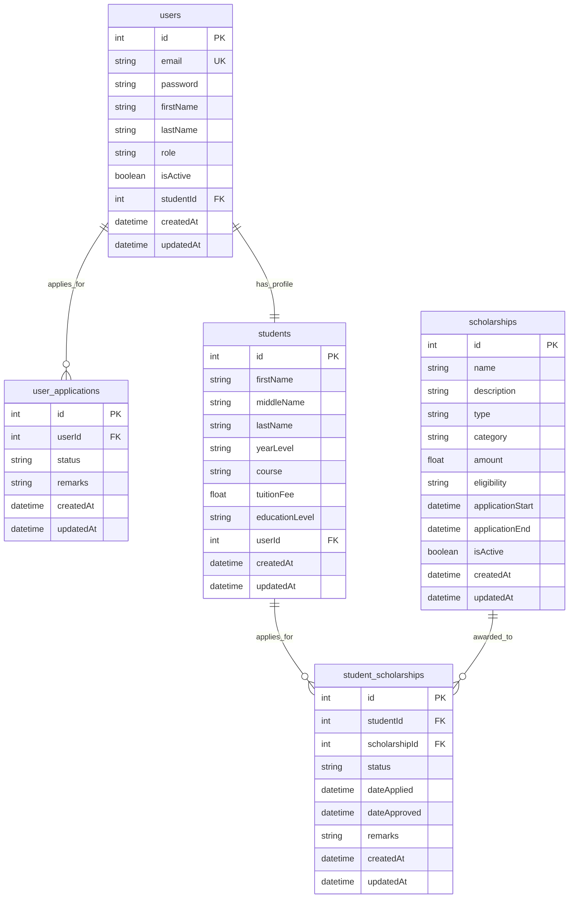

# Entity Relationship Diagram (ERD) for Scholarship Tracking System

## Entity Descriptions

### users

- Main authentication table for system users
- Can have roles like admin, staff, or student
- Links to student profiles

### user_applications

- Tracks applications made by users to become students
- Status can be Pending, Approved, or Rejected

### students

- Student profile information
- Contains academic details like year level, course, tuition fee
- Links back to user account

### scholarships

- Scholarship information including name, description, type, amount
- Tracks application periods and eligibility criteria
- Can be categorized as Internal or External

### student_scholarships

- Junction table linking students to scholarships
- Tracks application status and approval dates
