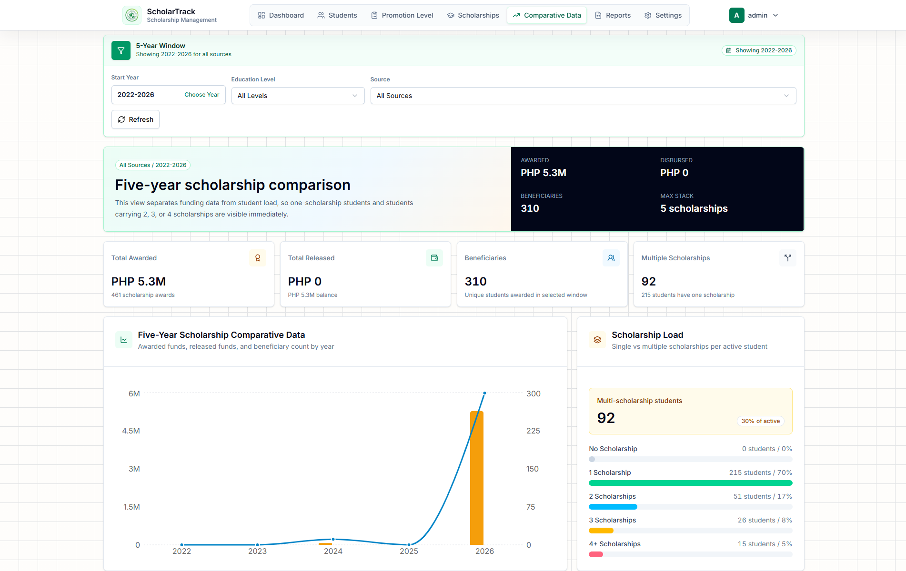
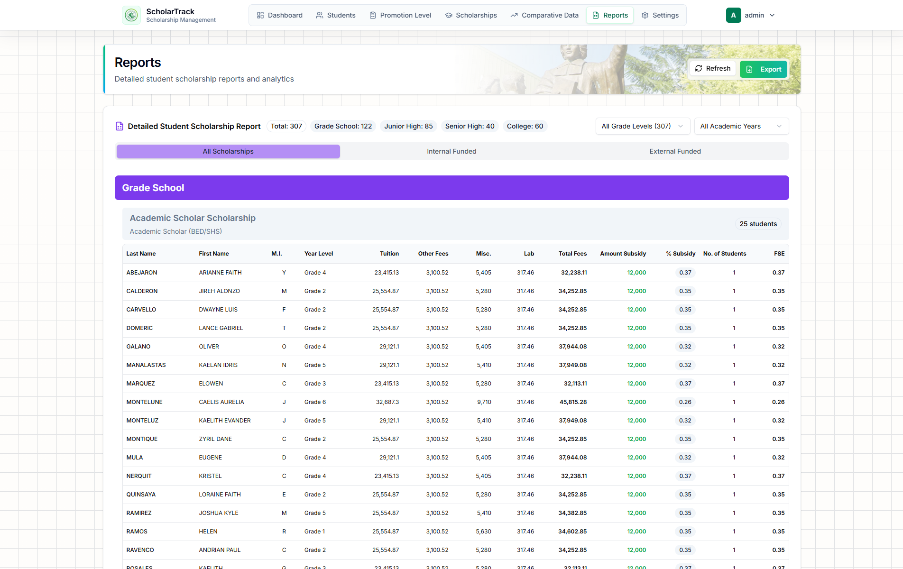

<div align="center">
  <h1>ScholarTrack</h1>
  <p><strong>Scholarship management, fee tracking, and reporting for academic institutions.</strong></p>
  <p>
    
    
    
    
  </p>
  
</div>

ScholarTrack is a web-based platform for administrators who manage student records, scholarship assignments, academic-year fees, disbursements, and compliance-ready reports — all in one workspace with role-based access control.

---

## Key Features

| Module | Description |
| --- | --- |
| **Dashboard** | Central overview of student counts, scholarship distribution, financial summaries, and recent activity |
| **Students** | Manage student profiles, scholarships, fee records, graduation status, and archival state |
| **Scholarships** | Configure scholarship programs, coverage rules, subsidy amounts, and eligibility |
| **Academic Years** | Organize records by academic year and semester for clean financial workflows |
| **Fee Management** | Record tuition, miscellaneous, laboratory, and other fees with automatic subsidy calculations and annual aggregation |
| **Disbursements** | Track scholarship payments linked to students, programs, and academic periods |
| **Reports** | Detailed student scholarship reports with annual aggregated fee data |
| **Comparative Data** | Five-year scholarship comparison with funding trends, beneficiary counts, and scholarship load analysis |
| **Exports** | Export reports in PDF, XLSX, and CSV formats |
| **RBAC** | ADMIN, STAFF, and VIEWER roles with permission-aware screens and API protection |

---

## Reports

The **Reports** page (`/reports`) provides a detailed student scholarship report organized by grade level and scholarship type. It features:

- **Annual aggregated fee data** — tuition, miscellaneous, lab, other fees summed across all semesters
- **Subsidy and EFC calculations** — computed from annual totals for accurate year-round assessment
- **Semester count badges** — indicates how many semesters are included per student
- **Filters** — by grade level, academic year, and funding source (internal / external / all)
- **Refresh** — manual refetch to reflect recent edits

> Reports can be exported in **PDF, XLSX (Excel), or CSV** format.

---

## Comparative Data

The **Comparative Data** page (`/scholarship-flow`) provides a five-year scholarship comparison view:

- **Awarded vs. Disbursed** — side-by-side funding bars with beneficiary trend lines
- **Scholarship Load** — breakdown of single vs. multiple scholarship students
- **Year-by-year cards** — per-year awarded/disbursed amounts with internal/external source splits
- **Top scholarship types** — horizontal bar chart of the most active programs
- **Multi-scholarship students** — detailed panel of students carrying multiple awards
- **Filterable** — by academic year window, education level, and funding source

---

## Export Output

ScholarTrack supports **three export formats**:

| Format | Description |
| --- | --- |
| **PDF** | Print-ready reports with tables and formatting (jsPDF + autoTable) |
| **XLSX** | Structured Excel workbooks — detailed student reports and summary by grade level (ExcelJS) |
| **CSV** | Comma-separated values for spreadsheet or data analysis tools |

Export endpoints are available for:
- **Detailed student scholarship report** (`/api/export/students`)
- **Summary by grade level** (`/api/export/summary`)

---

## Screenshots

| Dashboard | Comparative Data |
| --- | --- |
|  |  |

| Scholarship Management | Reports and Analytics |
| --- | --- |
|  |  |

---

## Quick Start

```bash
# Install dependencies
npm install

# Set up your .env file (see docs/SETUP.md)
# Seed database
npm run db:seed

# Start development server
npm run dev
```

Visit **[http://localhost:8080](http://localhost:8080)** to log in.

For full setup instructions, see the [Setup Guide](docs/SETUP.md).

---

## Documentation

| Document | Description |
| --- | --- |
| [Setup Guide](docs/SETUP.md) | Installation, environment variables, scripts |
| [Technical Reference](docs/TECHNICAL-REFERENCE.md) | Architecture, tech stack, DB schema, RBAC, performance, deployment |
| [Architecture Overview](ARCHITECTURE.md) | System architecture diagrams |
| [Annual Fee Aggregation Guide](docs/ANNUAL-FEE-AGGREGATION-GUIDE.md) | Multi-semester fee aggregation |
| [Feature Location Guide](docs/WHERE-TO-FIND-NEW-FEATURES.md) | Where to find UI features |
| [Entity Relationship Diagram](docs/ERD.svg) | Database visualization |

---

## License

See [LICENSE](LICENSE) for details.
