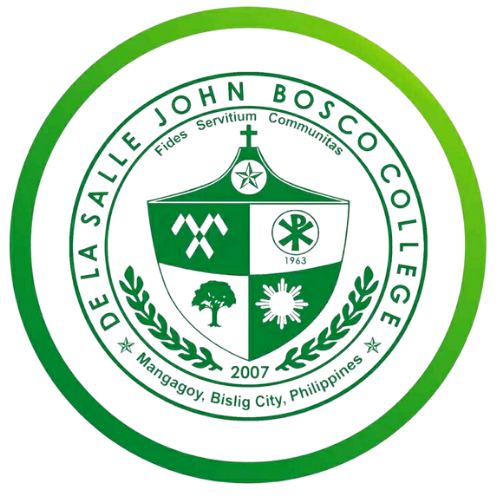

<div align="center">
  
  <h1>ScholarTrack</h1>
  <p><strong>Scholarship management, fee tracking, and reporting for academic institutions.</strong></p>
  <p>
    
    
    
    
  </p>
</div>

ScholarTrack is a web-based scholarship tracking system designed for administrators who need a reliable way to manage student records, scholarship assignments, academic-year fees, disbursements, and compliance-ready reports.

The system combines role-based access control, audit logging, fee aggregation, export workflows, and dashboard analytics into a single administrative workspace.

## Product Highlights

- **Student registry**: Manage student profiles, grade levels, academic status, graduation records, and archival state.
- **Scholarship administration**: Track scholarship types, grant rules, eligible programs, subsidy amounts, and covered fee categories.
- **Academic-year tracking**: Organize records by academic year and semester for cleaner financial and reporting workflows.
- **Fee management**: Record tuition, miscellaneous, laboratory, and other fees with automatic subsidy calculations.
- **Annual fee aggregation**: Summarize multi-semester student fees for accurate yearly reporting and EFC calculations.
- **Disbursement monitoring**: Connect scholarship payments to students, scholarships, and academic years.
- **Reports and analytics**: Review dashboard statistics, visual summaries, and exportable reports.
- **Role-based access control**: Support ADMIN, STAFF, and VIEWER roles with permission-aware screens and API protection.
- **Audit trail**: Log important system activity for accountability and operational review.
- **Performance-oriented data access**: Use indexed queries, Prisma aggregation, connection pooling, and client-side query caching.

## Screenshots

| Dashboard | Student Management |
| --- | --- |
|  |  |

| Scholarship Management | Reports and Analytics |
| --- | --- |
|  |  |

## Platform

| Category | Technology |
| --- | --- |
| Framework | Next.js App Router |
| Language | TypeScript |
| Database | PostgreSQL |
| ORM | Prisma |
| Authentication | JWT, HTTP-only cookies, bcryptjs |
| UI | React, shadcn/ui, Radix UI |
| Styling | Tailwind CSS |
| Data fetching | TanStack Query |
| Charts | Recharts |
| Exports | PDF, XLSX, CSV |
| Testing | Vitest |

## System Modules

ScholarTrack is organized around the main workflows used by scholarship administrators:

- **Dashboard**: Central overview of student counts, scholarship distribution, recent activity, and financial summaries.
- **Students**: CRUD workflows for student records, scholarship assignments, fee records, graduation status, and archiving.
- **Scholarships**: Scholarship program setup, coverage rules, subsidy configuration, eligibility, and status management.
- **Academic Years**: Year and semester structures used by fees, reports, and disbursements.
- **Disbursements**: Scholarship release tracking with links to students, programs, and academic periods.
- **Reports**: Aggregated scholarship, student, fee, and disbursement data with export support.
- **Settings**: User administration and role management for authorized administrators.

## Architecture

```text
src/
+-- app/                    # Next.js App Router pages and API routes
+-- components/             # UI, layout, dashboard, chart, form, and shared components
+-- hooks/                  # TanStack Query and API interaction hooks
+-- lib/                    # Auth, Prisma, validation, caching, scheduling, and domain services
+-- types/                  # Shared TypeScript definitions

prisma/
+-- schema.prisma           # Database schema
+-- migrations/             # Database migrations
+-- seed.ts                 # Seed workflow

docs/                       # ERD and feature documentation
tests/                      # Vitest test coverage
```

## Security and Governance

- JWT sessions are stored in HTTP-only cookies.
- Protected API routes enforce authentication and role-based authorization.
- Admin-only workflows include user management, student mutation, scholarship mutation, and graduation management.
- Account lockout settings help reduce brute-force login risk.
- Zod schemas validate request payloads before database operations.
- Audit logs capture important user and system activity.

## Documentation

- [Architecture overview](ARCHITECTURE.md)
- [Documentation index](docs/README.md)
- [Annual fee aggregation guide](docs/ANNUAL-FEE-AGGREGATION-GUIDE.md)
- [Feature location guide](docs/WHERE-TO-FIND-NEW-FEATURES.md)
- [Entity relationship diagram](docs/ERD.svg)

## License

See [LICENSE](LICENSE) for details.
