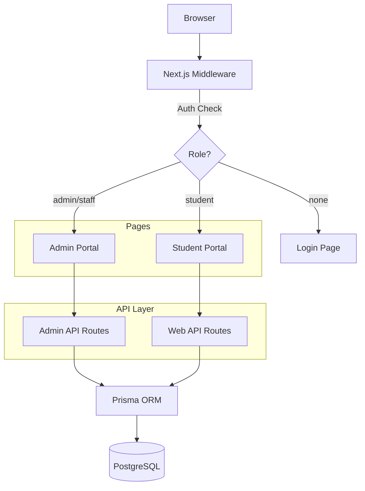
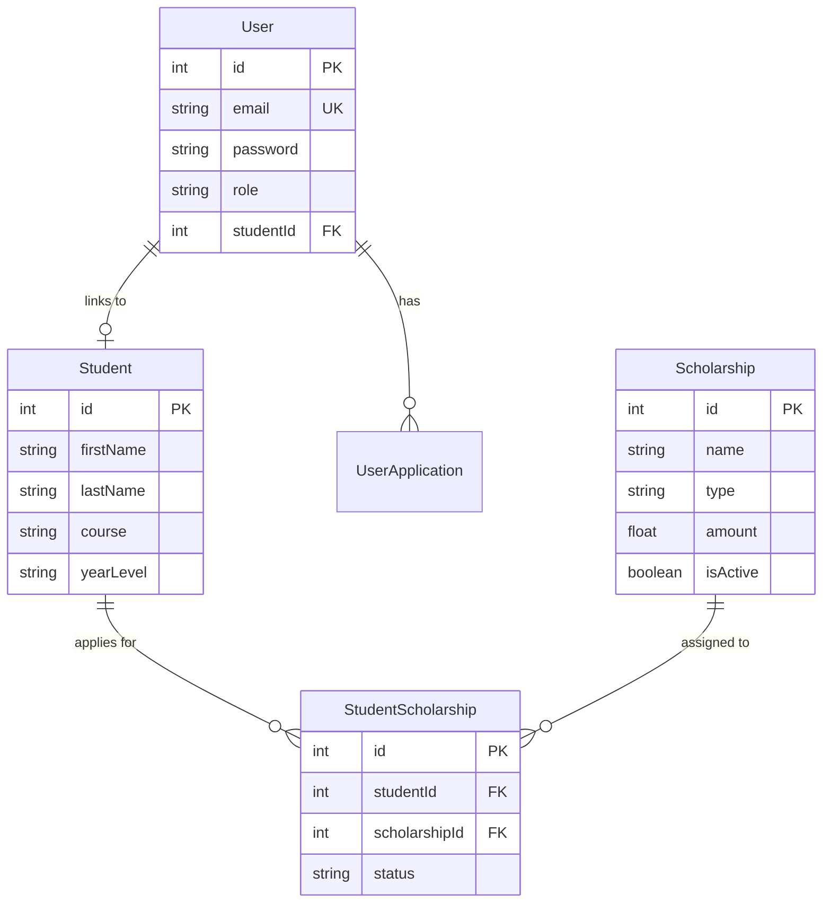

# ScholarTrack Architecture

> **Last Updated**: January 11, 2026

## Overview

ScholarTrack is a full-stack scholarship tracking system built with Next.js 16, using a **Role-Based Routing** architecture to serve two distinct user portals:

- **Admin Portal** (`/admin/*`) - For administrators and staff
- **Student Portal** (`/web/*`) - For students

## Architecture Diagram



## Technology Stack

| Layer | Technology |
|-------|------------|
| Frontend | Next.js 16, React 19, TypeScript |
| UI Components | shadcn/ui, Radix UI, Tailwind CSS v4 |
| State | React Hook Form, Custom Hooks |
| Backend | Next.js API Routes |
| Database | PostgreSQL, Prisma ORM |
| Authentication | JWT, Middleware |
| Deployment | Nginx (reverse proxy) |

## Folder Structure

```
src/
├── app/                    # Next.js App Router
│   ├── admin/             # Admin portal pages
│   ├── web/               # Student portal pages
│   ├── api/               # API routes
│   │   ├── admin/         # Admin-only APIs
│   │   └── web/           # Student APIs
│   └── layout.tsx         # Root layout
│
├── components/            # React components
│   ├── ui/                # shadcn/ui primitives
│   ├── forms/             # Form components
│   ├── layout/            # Layout components
│   ├── providers/         # Context providers
│   ├── shared/            # Shared utilities
│   ├── admin/             # Admin-specific
│   └── web/               # Student-specific
│
├── hooks/                 # Custom React hooks
├── lib/                   # Utilities & config
├── types/                 # TypeScript types
└── middleware.ts          # Auth middleware
```

## Key Design Decisions

### 1. Role-Based Routing

**Decision**: Separate portals by URL path (`/admin`, `/web`) rather than feature-based or subdomain separation.

**Rationale**:
- Single deployment simplifies infrastructure
- Shared codebase reduces duplication
- Clear URL patterns for users
- Middleware handles access control centrally

### 2. API Route Mirroring

**Decision**: API routes mirror page structure (`/api/admin/*`, `/api/web/*`).

**Rationale**:
- Easy to locate corresponding API for any page
- Natural role-based access control
- Clear separation of concerns

### 3. Component Organization

**Decision**: Hybrid approach with shared UI components and role-specific components.

**Rationale**:
- `ui/` contains reusable shadcn primitives
- `admin/` and `web/` contain portal-specific components
- `shared/` contains cross-cutting utilities

### 4. JWT Authentication

**Decision**: JWT tokens stored in HTTP-only cookies with middleware validation.

**Rationale**:
- Stateless authentication scales well
- Middleware provides centralized auth checks
- No need for external auth service

## Data Models



## Security

1. **Authentication**: JWT with 24h expiry
2. **Authorization**: Role-based middleware checks
3. **Password**: bcrypt hashing
4. **API Protection**: Role validation per route
5. **CSRF**: Same-origin cookie policy

## Deployment

Production deployment uses Nginx as a reverse proxy:

- SSL/TLS termination
- Static file caching
- Gzip compression
- Rate limiting
- Security headers

See `/nginx/README.md` for configuration details.
